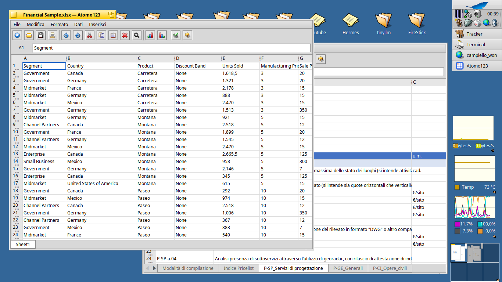

# Atomo123

Native spreadsheet application (Excel-style) for Haiku OS, built with
Haiku's own APIs (Interface/Layout Kit, Locale Kit, Translation Kit) —
compatible with files produced by Microsoft Excel and
OpenOffice/LibreOffice through Translation Kit conversion add-ons.



If Atomo123 saves you time, consider supporting development: [](https://buymeacoffee.com/atomozero)

## Status

Still early-stage — see [ROADMAP.md](ROADMAP.md) for the phased plan
and up-to-date status. In short: the calculation engine and legacy
Excel importer reuse and modernize the old BeOS **Sum-It** project
(community fork `OpenSumIt`), ported to build on modern 64-bit Haiku;
the UI is written from scratch in Interface/Layout Kit (the historical
pre-Layout-Kit UI code is not reused).

## Features

* Native Haiku GUI — Interface/Layout Kit only, no external toolkit
* Multi-sheet workbooks with a scrollable tab strip, like Excel/LibreOffice Calc
* Formulas with named functions (`SUM`, `IF`, `SUMIF`, ...) and cell/range references
* Cut/copy/paste through the real system clipboard, extended to multi-cell ranges
* Undo/redo, Find & replace, sort ascending/descending, fill down/right
* Insert/delete rows and columns
* Bar charts and pivot tables
* Opens CSV/XLS/XLSX/ODS through Translation Kit add-ons (`BTranslatorRoster`
  picks the right one automatically); imports column widths and cell/column
  background/text colors from XLSX theme and direct styles
* Native ASCD/ASCB file format round-trips everything above (multiple sheets,
  charts, colors, column widths), not just cell values
* Registers itself as Tracker's preferred app for its supported file types, so
  double-clicking a spreadsheet opens it directly — without overriding a choice
  already made by the user or another app
* Opens each new file in its own window instead of replacing the one you
  already have open
* Toolbar built from real HVIF vector icons, grouped by category
  (File/Edit/Data/Insert) with separators, icon-only with tooltips
* No external dependencies beyond Haiku system libraries

## Quick start

```
cd ui
make
./Atomo123
```

To open CSV/XLS/XLSX/ODS files (not just the native ASCD format), install
the corresponding Translation Kit add-ons once:

```
cd translators/csv && make && make install
cd translators/xls && make && make install
cd translators/xlsx && make && make install
cd translators/ods && make && make install
```

`make install` copies the add-on to
`~/config/non-packaged/add-ons/Translators/`, where Atomo123's Translation
Kit finds it automatically.

## Repository layout

```
legacy/opensumit/   historical Sum-It/OpenSumIt source, patched to build on
                     64-bit Haiku (see PORTING_STATUS.md)
engine/              isolated calculation engine
translators/         Translation Kit add-ons for xlsx/ods/csv/xls
ui/                  native Interface/Layout Kit application
docs/                technical research, architecture, porting notes
```

## Build

Requires Haiku with GCC and standard system libraries (`libbe`,
`libtranslation`, `libtracker`).

```
cd engine && make && make test                              # isolated engine
cd translators/<name> && make && make test && make install  # csv/xls/xlsx/ods
cd ui && make && make run                                   # the app (needs a graphical session)
```

## Documentation

- [ROADMAP.md](ROADMAP.md) — project phases and current status
- [docs/GUIDA_RAPIDA.md](docs/GUIDA_RAPIDA.md) — one-minute essential guide
  (Italian)
- [docs/USER_GUIDE.md](docs/USER_GUIDE.md) — full guide for using the app
  (not for developing the code)
- [docs/RESEARCH.md](docs/RESEARCH.md) — initial technical research (Haiku
  APIs, file format libraries, Sum-It evaluation)
- [docs/ENGINE_API.md](docs/ENGINE_API.md) — isolated calculation engine
  architecture, stubs, bugs found
- [docs/TRANSLATORS.md](docs/TRANSLATORS.md) — CSV/XLS/XLSX/ODS translator
  architecture
- [docs/UI_ARCHITECTURE.md](docs/UI_ARCHITECTURE.md) — native app
  architecture, bugs found
- [legacy/opensumit/PORTING_STATUS.md](legacy/opensumit/PORTING_STATUS.md) —
  technical detail of the 64-bit port of the historical code

## License

New code in this project (`translators/`, `ui/`, `docs/`, `packaging/`) is
distributed under the **MIT** license — see [LICENSE](LICENSE).

Code under `legacy/opensumit/` comes from the Sum-It project (Copyright
1996-2000 Hekkelman Programmatuur B.V.) and is distributed under a 4-clause
BSD license, including the advertising clause — see
`legacy/opensumit/sum-it/Docs/Licence`. `engine/` extracts and modifies that
historical code (not a rewrite from scratch), so it stays under that same
4-clause BSD license, not MIT — see [LICENSE](LICENSE) for full detail. Any
binary distribution that includes `legacy/opensumit/` or `engine/` code must
honor the advertising clause.

## Be careful
> **Developer's Note**: This software may contain traces of peanuts and LLM.
> It has been developed with passion for the Haiku platform.

## Support

If you find this project useful, you can buy me a coffee: [](https://buymeacoffee.com/atomozero)
